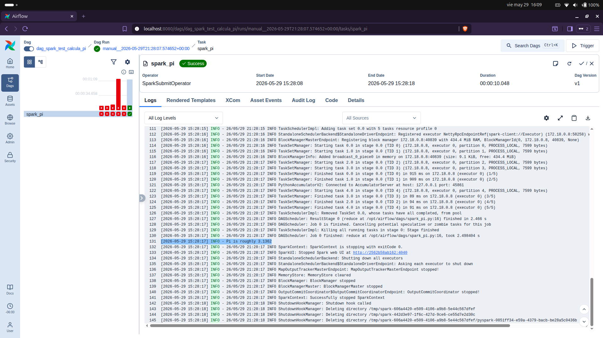

# Ejercicio Adiconal

## SPARK en en el Entorno

Para no cargar los workers de Airflow se incluye un contenedor de SPARK en el entorno, se agrgaron los siguientes servicios, volúmenes y la variable de entorno en el archivo docker-compose.yaml.  

Creamos el directorio `Spark/spark-data` para el volumen del contenedor.  

```bash
mkdir -p Spark/spark-data
```

**Igualar Instancia de SPARK y Airflow 3.2.0** 

La imagen `apache/spark:3.5.1-python3` tiene **Python 3.8**  y la imagen de Airflow **Python 3.13.12** por lo tanto hay incompatibilidad. Debemos igualar las versiones en ambas instancias.  

Vamos a subir la version de **Python 3.8** a la **Python 3.13** en la imagen `apache/spark:3.5.1-python3`.  

Esto lo vamos hacer creadno el archivo `Dockerfile.spark`  dentro de este archivo vamos a compilar **Python 3.13** por que no se encuentra en los repositorios.  

```dockerfile
FROM apache/spark:3.5.1-python3

USER root

# Instalar dependencias necesarias para compilar Python
RUN apt-get update && apt-get install -y --no-install-recommends \
    build-essential \
    wget \
    libssl-dev \
    libffi-dev \
    libbz2-dev \
    libreadline-dev \
    libsqlite3-dev \
    zlib1g-dev \
    libncurses5-dev \
    libgdbm-dev \
    libnss3-dev \
    && rm -rf /var/lib/apt/lists/*

# Descargar y compilar Python 3.13.0
RUN wget https://www.python.org/ftp/python/3.13.0/Python-3.13.0.tgz && \
    tar xzf Python-3.13.0.tgz && \
    cd Python-3.13.0 && \
    ./configure --enable-optimizations --with-ensurepip=install && \
    make -j$(nproc) && \
    make altinstall && \
    cd .. && rm -rf Python-3.13.0*

# Crear un enlace simbólico 'python3.13' si no se creó (por si acaso)
RUN ln -sf /usr/local/bin/python3.13 /usr/local/bin/python3

# Establecer la variable para que PySpark use este Python
ENV PYSPARK_PYTHON=/usr/local/bin/python3.13

USER spark
```  


Ahora vamos a colocar en nuestro archivo `docker-compose.yaml` los servicios de SPARK.  


```yaml
  # Servicio
  spark-master:
    #image: apache/spark:3.5.1-python3
    build:
      context: .
      dockerfile: Dockerfile.spark
    container_name: spark-master
    command: /opt/spark/bin/spark-class org.apache.spark.deploy.master.Master
    environment:
      - SPARK_MASTER_HOST=spark-master
      - SPARK_MASTER_PORT=7077
      - SPARK_MASTER_WEBUI_PORT=8080
    ports:
      - "8081:8080"   # UI
      - "7077:7077"   # Comunicación
    volumes:
      - ./Spark/spark-data:/opt/spark/data
    healthcheck:
      test: ["CMD", "curl", "-f", "http://localhost:8080/"]
      interval: 10s
      timeout: 5s
      retries: 5
    restart: unless-stopped

  spark-worker:
    #image: apache/spark:3.5.1-python3
    build:
      context: .
      dockerfile: Dockerfile.spark
    container_name: spark-worker
    command: /opt/spark/bin/spark-class org.apache.spark.deploy.worker.Worker spark://spark-master:7077
    environment:
      - SPARK_WORKER_MEMORY=2G
      - SPARK_WORKER_CORES=2
      - SPARK_WORKER_WEBUI_PORT=8081
    ports:
      - "8082:8081"   # UI worker
    depends_on:
      - spark-master
    volumes:
      - ./Spark/spark-data:/opt/spark/data
    restart: unless-stopped


```

Variable de Entorno  

```yaml
# Variable de entorno en environment de x-airflow-common
SPARK_MASTER: spark://spark-master:7077
```  

**Reconstruir y levantar**  


```bash
docker compose build 
docker compose up -d 
```

La compilación tomará unos minutos (según recursos). Una vez lista validamos la version ejecutando.

```bash
docker exec spark-worker python3 --version
```

Debe responder `Python 3.13.0`.


## Conexión Spark en Airflow

**Instalar dependencias en Airflow**  

El `SparkSubmitOperator` necesita los paquetes `pyspark` y `apache-airflow-providers-apache-spark`. Como estás usando la variable `_PIP_ADDITIONAL_REQUIREMENTS`, puedes cambiarla temporalmente en tu archivo `.env` o en el `docker-compose.yaml`:

```yaml
# En el entorno común de Airflow (x-airflow-common.environment)
_PIP_ADDITIONAL_REQUIREMENTS: ${_PIP_ADDITIONAL_REQUIREMENTS:- polars trino pyspark apache-airflow-providers-apache-spark}
```

Si no, ejecuta dentro del contenedor del scheduler (o worker) un `pip install pyspark apache-airflow-providers-apache-spark`.  

**Crear conexion en Airflow**  

Aunque el DAG usa `conn_id="spark_default"`, no es obligatorio; podrías pasar directamente `spark://spark-master:7077` como argumento `master`. Si prefieres usar la conexión:

1. En la interfaz web de Airflow, ve a **Admin → Connections**.
2. Crea una nueva conexión con:
   - Connection Id: `spark_default`
   - Connection Type: `Spark`
   - Host: `spark://spark-master`
   - Port: `7077`

Si prefieres no crear la conexión, modifica la línea del `SparkSubmitOperator`:

```python
        master="spark://spark-master:7077",  # En lugar de conn_id
```  

## JAVA 17  

Airflow (el worker) ejecuta localmente el comando `spark-submit`, que necesita **Java**. Como `JAVA_HOME` no está configurado. La imagen oficial de Airflow no incluye Java. Por lo que se debe instalar, en este caso SPARK esta usando JAVA 17.  

**Añadir Java 17 en el Dockerfile**

En el Dockerfile agregamos lo siguinte.

```dockerfile
FROM apache/airflow:3.2.0   # o la imagen base que estés usando

# Cambiar a root para instalar paquetes del sistema
USER root
RUN apt-get update && apt-get install -y openjdk-17-jdk-headless && rm -rf /var/lib/apt/lists/*

# Volver al usuario airflow
USER airflow

# (Opcional) Asegurar pyspark y el provider, si no los tienes en _PIP_ADDITIONAL_REQUIREMENTS
RUN pip install --no-cache-dir pyspark apache-airflow-providers-apache-spark
```  

**Reconstruir la imagen de Airflow** 

Ejecuta en la misma carpeta donde está el `docker-compose.yaml`:

```bash
docker compose build
```

**Luego reinicia los servicios:**  

```bash
docker compose up -d
```

**Verificar que Java funcione dentro del contenedor**  
Puedes comprobar entrando al worker:

```bash
docker compose exec airflow-worker bash
java -version
```

Debemos ver `openjdk version "17.x.x"`.  

## Probar SPARK desde Airflow  

Ya que tenemos nuestro entorno iniciado y la conexion hacia Spark en Airflow, vamos a crear un DAG para validar que Spark se integro correctamente a nuestro entorno.  

Primero creamos el archivo **spark_pi.py** dentro de `Airflow/dags/`  

```python
# Archivo: spark_pi.py (dentro de Airflow/dags/)
import sys
from random import random
from operator import add
from pyspark.sql import SparkSession

if __name__ == "__main__":
    spark = SparkSession.builder.appName("PythonPi").getOrCreate()
    partitions = int(sys.argv[1]) if len(sys.argv) > 1 else 5
    n = 100000 * partitions

    def f(_):
        x, y = random(), random()
        return 1 if x * x + y * y <= 1 else 0

    count = spark.sparkContext.parallelize(range(1, n + 1), partitions).map(f).reduce(add)
    pi_val = 4.0 * count / n
    print(f"Pi is roughly {pi_val}")
    spark.stop()
```


Ahora creamos el DAG **dag_spark_test_calcula_pi**  

```python
# Archivo: test_spark_dag.py (dentro de Airflow/dags/)
from datetime import datetime
from airflow import DAG
from airflow.providers.apache.spark.operators.spark_submit import SparkSubmitOperator

default_args = {
    "owner": "airflow",
    "start_date": datetime(2026, 5, 1),
    "retries": 0,
}

with DAG(
    dag_id="dag_spark_test_calcula_pi",
    default_args=default_args,
    schedule=None,
    catchup=False,
    description="DAG de prueba para Spark en cluster externo",
    tags=["spark", "test"],
) as dag:

    spark_pi = SparkSubmitOperator(
        task_id="spark_pi",
        application="/opt/airflow/dags/spark_pi.py",  # Ruta dentro del contenedor
        conn_id="spark_default",                       # Usa la conexión Spark (ver abajo)
        application_args=["5"],                         # Número de particiones
        total_executor_cores=2,
        executor_memory="1G",
        name="test_pi",
        verbose=True,
    )

    spark_pi
```  

El DAG de terminar exitosamente y mostrar el resultado `Pi is roughly 3.1362` como lo podemos observar en la siguiente imagen.  
  

# DAG Ecobici  

Ahora que tenemos todo listo vamos a proceder a crear nuestro DAG para el estado de las estaciones Ecobici.  


|
