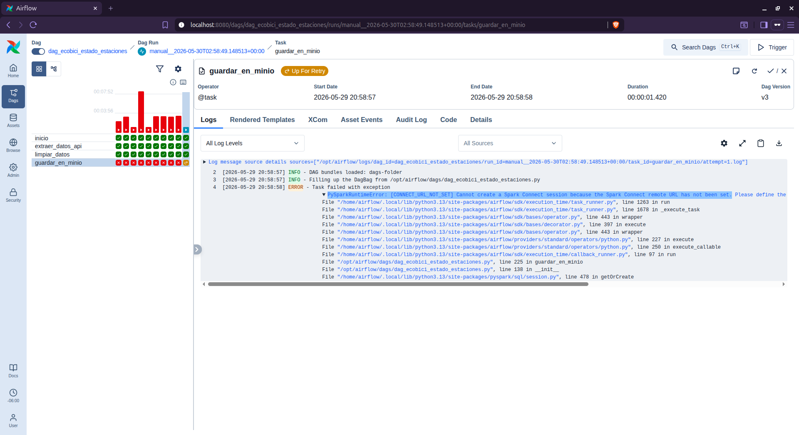

# Ejercicio Adiconal

## SPARK en en el Entorno

Para no cargar los workers de Airflow se incluye un contenedor de SPARK en el entorno, se agrgaron los siguientes servicios, volúmenes y la variable de entorno en el archivo docker-compose.yaml.  

Creamos el directorio `Spark/spark-data` para el volumen del contenedor.  

```bash
mkdir -p Spark/spark-data
```

**Igualar Instancia de SPARK y Airflow 3.2.0** 

La imagen `apache/spark:3.5.1-python3` tiene **Python 3.8**  y la imagen de Airflow **Python 3.13.12** por lo tanto hay incompatibilidad. Debemos igualar las versiones en ambas instancias.  

Vamos a subir la version de **Python 3.8** a la **Python 3.13** en la imagen `apache/spark:3.5.1-python3`.  

Esto lo vamos hacer creadno el archivo `Dockerfile.spark`  dentro de este archivo vamos a compilar **Python 3.13** por que no se encuentra en los repositorios.  

```dockerfile
FROM apache/spark:3.5.1-python3

USER root

# Instalar dependencias necesarias para compilar Python
RUN apt-get update && apt-get install -y --no-install-recommends \
    build-essential \
    wget \
    libssl-dev \
    libffi-dev \
    libbz2-dev \
    libreadline-dev \
    libsqlite3-dev \
    zlib1g-dev \
    libncurses5-dev \
    libgdbm-dev \
    libnss3-dev \
    && rm -rf /var/lib/apt/lists/*

# Descargar y compilar Python 3.13.0
RUN wget https://www.python.org/ftp/python/3.13.0/Python-3.13.0.tgz && \
    tar xzf Python-3.13.0.tgz && \
    cd Python-3.13.0 && \
    ./configure --enable-optimizations --with-ensurepip=install && \
    make -j$(nproc) && \
    make altinstall && \
    cd .. && rm -rf Python-3.13.0*

# Crear un enlace simbólico 'python3.13' si no se creó (por si acaso)
RUN ln -sf /usr/local/bin/python3.13 /usr/local/bin/python3

# Establecer la variable para que PySpark use este Python
ENV PYSPARK_PYTHON=/usr/local/bin/python3.13

USER spark
```  


Ahora vamos a colocar en nuestro archivo `docker-compose.yaml` los servicios de SPARK.  


```yaml
  # Servicio
  spark-master:
    #image: apache/spark:3.5.1-python3
    build:
      context: .
      dockerfile: Dockerfile.spark
    container_name: spark-master
    command: /opt/spark/bin/spark-class org.apache.spark.deploy.master.Master
    environment:
      - SPARK_MASTER_HOST=spark-master
      - SPARK_MASTER_PORT=7077
      - SPARK_MASTER_WEBUI_PORT=8080
    ports:
      - "8081:8080"   # UI
      - "7077:7077"   # Comunicación
    volumes:
      - ./Spark/spark-data:/opt/spark/data
    healthcheck:
      test: ["CMD", "curl", "-f", "http://localhost:8080/"]
      interval: 10s
      timeout: 5s
      retries: 5
    restart: unless-stopped

  spark-worker:
    #image: apache/spark:3.5.1-python3
    build:
      context: .
      dockerfile: Dockerfile.spark
    container_name: spark-worker
    command: /opt/spark/bin/spark-class org.apache.spark.deploy.worker.Worker spark://spark-master:7077
    environment:
      - SPARK_WORKER_MEMORY=2G
      - SPARK_WORKER_CORES=2
      - SPARK_WORKER_WEBUI_PORT=8081
    ports:
      - "8082:8081"   # UI worker
    depends_on:
      - spark-master
    volumes:
      - ./Spark/spark-data:/opt/spark/data
    restart: unless-stopped


```

Variable de Entorno  

```yaml
# Variable de entorno en environment de x-airflow-common
SPARK_MASTER: spark://spark-master:7077
```  

**Reconstruir y levantar**  


```bash
docker compose build 
docker compose up -d 
```

La compilación tomará unos minutos (según recursos). Una vez lista validamos la version ejecutando.

```bash
docker exec spark-worker python3 --version
```

Debe responder `Python 3.13.0`.


## Conexión Spark en Airflow

**Instalar dependencias en Airflow**  

El `SparkSubmitOperator` necesita los paquetes `pyspark` y `apache-airflow-providers-apache-spark`. Como estás usando la variable `_PIP_ADDITIONAL_REQUIREMENTS`, puedes cambiarla temporalmente en tu archivo `.env` o en el `docker-compose.yaml`:

```yaml
# En el entorno común de Airflow (x-airflow-common.environment)
_PIP_ADDITIONAL_REQUIREMENTS: ${_PIP_ADDITIONAL_REQUIREMENTS:- polars trino pyspark apache-airflow-providers-apache-spark}
```

Si no, ejecuta dentro del contenedor del scheduler (o worker) un `pip install pyspark apache-airflow-providers-apache-spark`.  

**Crear conexion en Airflow**  

Aunque el DAG usa `conn_id="spark_default"`, no es obligatorio; podrías pasar directamente `spark://spark-master:7077` como argumento `master`. Si prefieres usar la conexión:

1. En la interfaz web de Airflow, ve a **Admin → Connections**.
2. Crea una nueva conexión con:
   - Connection Id: `spark_default`
   - Connection Type: `Spark`
   - Host: `spark://spark-master`
   - Port: `7077`

Si prefieres no crear la conexión, modifica la línea del `SparkSubmitOperator`:

```python
        master="spark://spark-master:7077",  # En lugar de conn_id
```  

## JAVA 17  

Airflow (el worker) ejecuta localmente el comando `spark-submit`, que necesita **Java**. Como `JAVA_HOME` no está configurado. La imagen oficial de Airflow no incluye Java. Por lo que se debe instalar, en este caso SPARK esta usando JAVA 17.  

**Añadir Java 17 en el Dockerfile**

En el Dockerfile agregamos lo siguinte.

```dockerfile
FROM apache/airflow:3.2.0   # o la imagen base que estés usando

# Cambiar a root para instalar paquetes del sistema
USER root
RUN apt-get update && apt-get install -y openjdk-17-jdk-headless && rm -rf /var/lib/apt/lists/*

# Volver al usuario airflow
USER airflow

# (Opcional) Asegurar pyspark y el provider, si no los tienes en _PIP_ADDITIONAL_REQUIREMENTS
RUN pip install --no-cache-dir pyspark apache-airflow-providers-apache-spark
```  

**Reconstruir la imagen de Airflow** 

Ejecuta en la misma carpeta donde está el `docker-compose.yaml`:

```bash
docker compose build
```

**Luego reinicia los servicios:**  

```bash
docker compose up -d
```

**Verificar que Java funcione dentro del contenedor**  
Puedes comprobar entrando al worker:

```bash
docker compose exec airflow-worker bash
java -version
```

Debemos ver `openjdk version "17.x.x"`.  

## Probar SPARK desde Airflow  

Ya que tenemos nuestro entorno iniciado y la conexion hacia Spark en Airflow, vamos a crear un DAG para validar que Spark se integro correctamente a nuestro entorno.  

Primero creamos el archivo **spark_pi.py** dentro de `Airflow/dags/`  

```python
# Archivo: spark_pi.py (dentro de Airflow/dags/)
import sys
from random import random
from operator import add
from pyspark.sql import SparkSession

if __name__ == "__main__":
    spark = SparkSession.builder.appName("PythonPi").getOrCreate()
    partitions = int(sys.argv[1]) if len(sys.argv) > 1 else 5
    n = 100000 * partitions

    def f(_):
        x, y = random(), random()
        return 1 if x * x + y * y <= 1 else 0

    count = spark.sparkContext.parallelize(range(1, n + 1), partitions).map(f).reduce(add)
    pi_val = 4.0 * count / n
    print(f"Pi is roughly {pi_val}")
    spark.stop()
```


Ahora creamos el DAG **dag_spark_test_calcula_pi**  

```python
# Archivo: test_spark_dag.py (dentro de Airflow/dags/)
from datetime import datetime
from airflow import DAG
from airflow.providers.apache.spark.operators.spark_submit import SparkSubmitOperator

default_args = {
    "owner": "airflow",
    "start_date": datetime(2026, 5, 1),
    "retries": 0,
}

with DAG(
    dag_id="dag_spark_test_calcula_pi",
    default_args=default_args,
    schedule=None,
    catchup=False,
    description="DAG de prueba para Spark en cluster externo",
    tags=["spark", "test"],
) as dag:

    spark_pi = SparkSubmitOperator(
        task_id="spark_pi",
        application="/opt/airflow/dags/spark_pi.py",  # Ruta dentro del contenedor
        conn_id="spark_default",                       # Usa la conexión Spark (ver abajo)
        application_args=["5"],                         # Número de particiones
        total_executor_cores=2,
        executor_memory="1G",
        name="test_pi",
        verbose=True,
    )

    spark_pi
```  

El DAG de terminar exitosamente y mostrar el resultado `Pi is roughly 3.1362` como lo podemos observar en la siguiente imagen.  
  

<br>
<br>
<br>  

# DAG Ecobici Estado de Estaciones

Ahora que tenemos todo listo vamos a proceder a crear nuestro DAG para el estado de las estaciones Ecobici.  

El DAG [dag_ecobici_estado_estaciones](../ejercicio1/Airflow/dags/dag_ecobici_estado_estaciones.py) tomara los registros del Estado de las Estaciones para llevar acabo las tareas indicadas.  


En este DAG logre desarrollar hasta la tarea de limpieza de datos, en la tarea para trabajr con SPARK tengo un error en  [CONNECT_URL_NOT_SET] continuare trabajando para resolver el error.


  


### ERROR `[CONNECT_URL_NOT_SET]`  

La URL `spark://spark-master:7077` **no es válida** para una sesión de **Spark Connect**.

El error `[CONNECT_URL_NOT_SET]` ocurre específicamente porque el modo **Spark Connect**, requiere un protocolo y formato de URL diferentes a los del Spark tradicional.

## Diferencias Clave de Protocolo

### 1. Spark Connect 
Si tu código utiliza `.remote()` o la variable `SPARK_REMOTE`, **debes** usar el protocolo `sc://`.
*   **Formato válido:** `sc://host:port`
*   **Ejemplo correcto:** `sc://spark-master:15002`
*   **Puerto por defecto:** 15002

### 2. Spark Tradicional (Standalone/Cluster)
El protocolo `spark://` se utiliza exclusivamente para conexiones de cluster tradicionales (Standalone) configuradas mediante `.master()`.
*   **Formato válido:** `spark://host:port`
*   **Ejemplo:** `spark://spark-master:7077`
*   **Incompatibilidad:** No funcionará con `.remote()`.

## Solución

Hay dos opciones dependiendo de la arquitectura:

**Opción A: Usar Spark Connect (Recomendado para clientes remotos)**
Cambia el protocolo de `spark://` a `sc://` y asegúrate de incluir el puerto (generalmente 15002).
```python
spark = SparkSession.builder.remote("sc://spark-master:15002").getOrCreate()
```

**Opción B: Usar Spark Tradicional**
Si tu servidor no tiene habilitado el servicio Spark Connect, debes cambiar tu código para usar `.master()` en lugar de `.remote()`.
```python
spark = SparkSession.builder.master("spark://spark-master:7077").getOrCreate()
```


## Validar si la conexión `sc://localhost:15002` está funcionando correctamente.

El método más fiable es intentar crear una sesión y ejecutar una operación trivial (como contar un rango de números). Si el servidor no está activo, el script lanzará una excepción de conexión.

### Opción 1: Script de Validación (Recomendado)

Crear archivo `test_connection.py` ejecutarlo en el contenedor de Airflow. Este codigo intenta crear un DataFrame simple y mostrar un resultado.

```python
from pyspark.sql.connect.session import SparkSession
import sys

def test_spark_connect():
    remote_url = "sc://localhost:15002"
    print(f"Intentando conectar a {remote_url}...")
    
    try:
        # 1. Crear la sesión
        spark = SparkSession.builder.remote(remote_url).getOrCreate()
        
        # 2. Ejecutar una operación simple para validar la comunicación gRPC
        # Si esto funciona, la conexión es exitosa
        df = spark.range(10)
        count = df.count()
        
        print(f"✅ ¡Conexión exitosa! El servidor devolvió el conteo: {count}")
        print(f"   Versión del servidor: {spark.version}")
        return True

    except Exception as e:
        print(f"❌ Error de conexión: {type(e).__name__}")
        print(f"   Detalle: {str(e)}")
        print("\nPosibles causas:")
        print("  - El servidor Spark Connect no está ejecutándose.")
        print("  - El puerto 15002 está bloqueado por un firewall.")
        print("  - La URL es incorrecta.")
        return False

if __name__ == "__main__":
    success = test_spark_connect()
    sys.exit(0 if success else 1)
```

### Opción 2: Comando Rápido (One-liner)

Verificación rápida desde la terminal sin crear un archivo, ejecuta este comando directamente en tu shell (Linux/Mac/PowerShell):

```bash
python -c "from pyspark.sql.connect.session import SparkSession; print('OK' if SparkSession.builder.remote('sc://localhost:15002').getOrCreate().range(1).count() == 1 else 'FAIL')"
```

*   **Salida esperada:** `OK`
*   **Si falla:** Mostrará un rastro de error (traceback) indicando `UNAVAILABLE` o `Connection Refused`.

### ¿Qué hacer si falla?

Si recibes un error de conexión, verifica lo siguiente:

1.  **El servidor está activo:** Asegúrate de haber iniciado el servidor Spark Connect. El comando típico es:
    ```bash
    $SPARK_HOME/sbin/start-connect-server.sh
    ```
2.  **Puerto correcto:** Confirma que el servidor está escuchando en el puerto **15002** (el predeterminado).
3.  **Versión compatible:** Tu cliente PySpark debe tener la extensión de connect instalada (`pip install pyspark[connect]`) y la versión debe ser compatible con el servidor (generalmente Spark 3.4+ o 4.x).

4. No Existe el Servidor Spark Coonect.


### JAR Necesarios  en el Servidor o Contenedor Spark Connect

Es común que en las instalaciones básicas de Spark o contenedores Docker que solo traen el núcleo de Spark. **no incluye los archivos JAR necesarios** para ejecutar el servidor Spark Connect (`spark-connect_2.13` o `spark-connect_2.12`).  
Para solucionarlo, se debe agregar explícitamente el paquete `spark-connect` al iniciar el servidor.

### Opción 1: Usar `spark-submit` con `--packages` (Recomendado)

Esta es la forma más rápida. En lugar de ejecutar la clase directamente con java o el script básico, usa `spark-submit` especificando el paquete de Maven.

Ejecutar este comando en la terminal del contenedor de SPARK (ajusta la versión `3.5.7` o `4.0.1` según tu instalación de Spark):

```bash
# Para Spark 3.5.x
$SPARK_HOME/bin/spark-submit \
  --packages org.apache.spark:spark-connect_2.12:3.5.7 \
  --class org.apache.spark.sql.connect.service.SparkConnectServer \
  --name "SparkConnectServer" \
  --master local[*]

# Para Spark 4.0.x (usa _2.13)
$SPARK_HOME/bin/spark-submit \
  --packages org.apache.spark:spark-connect_2.13:4.0.1 \
  --class org.apache.spark.sql.connect.service.SparkConnectServer \
  --name "SparkConnectServer" \
  --master local[*]
```

*Nota: Si no existe la variable `$SPARK_HOME` configurada, se debe usar la ruta completa donde esta instalado Spark (ej. `/opt/spark/bin/spark-submit`).*

### Opción 2: Script de Inicio Permanente

Si es necesario iniciar este servidor frecuentemente, se debe crea un script llamado `start-connect.sh` con el siguiente contenido. Esto descarga los JARs la primera vez y los guarda en caché.

```bash
#!/bin/bash

# Configuración
SPARK_VERSION="3.5.7" # Cambia a 4.0.1 si usas Spark 4
SCALA_VERSION="2.12"  # Cambia a 2.13 si usas Spark 4

echo "Iniciando Spark Connect Server..."

$SPARK_HOME/bin/spark-submit \
  --name "SparkConnectServer" \
  --master "local[*]" \
  --conf "spark.driver.bindAddress=0.0.0.0" \
  --conf "spark.driver.host=localhost" \
  --packages "org.apache.spark:spark-connect_${SCALA_VERSION}:${SPARK_VERSION}" \
  --class "org.apache.spark.sql.connect.service.SparkConnectServer"
```

Dar permisos de ejecución y ejecútarlo:
```bash
chmod +x start-connect.sh
./start-connect.sh
```

### Verificación de Versión

Es crucial que la versión del paquete coincida con la instalación base de Spark.
1.  Ejecuta `$SPARK_HOME/bin/spark-submit --version` para ver tu versión actual.
2.  Si es **3.5.x**, usa `spark-connect_2.12:3.5.x`.
3.  Si es **4.0.x**, usa `spark-connect_2.13:4.0.x`.

## Habilitar el servidor Spark Connect permanentemente en un entorno Docker  

En el archivo Dockerfile.spark habilitaremos el inicio permante de Spark Connect.

