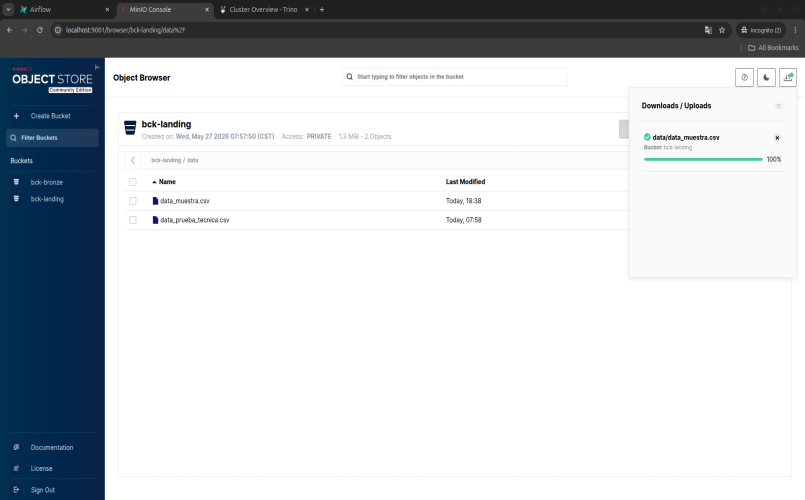
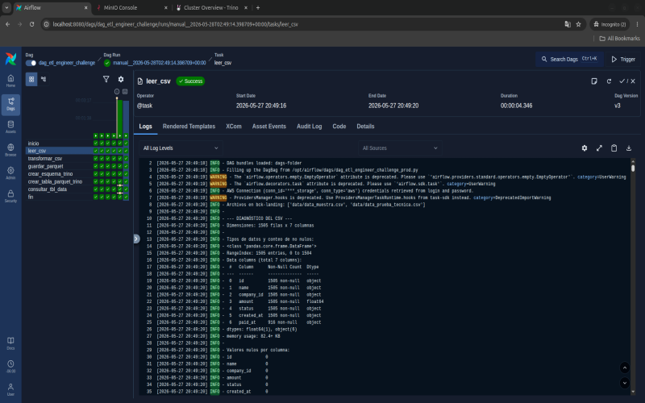
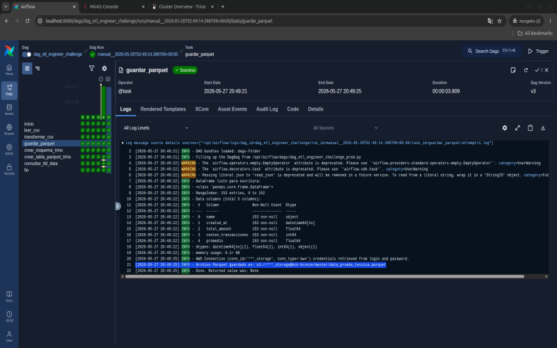
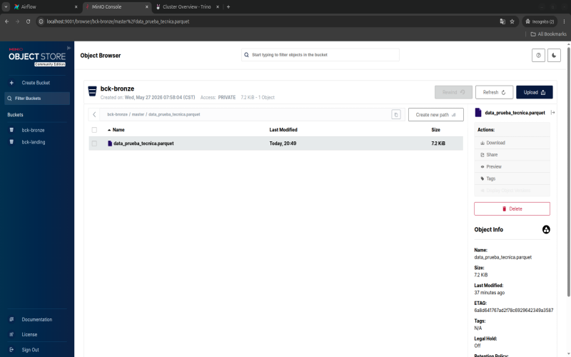
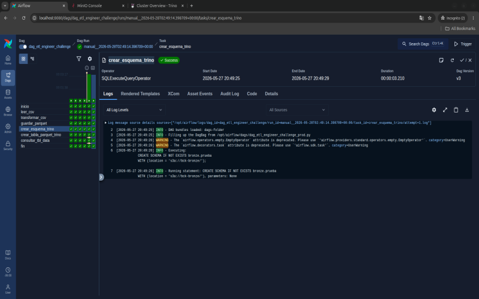
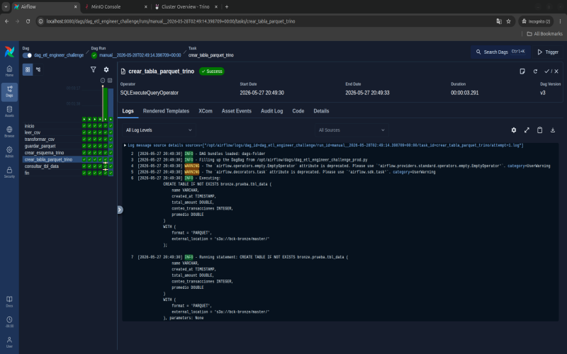
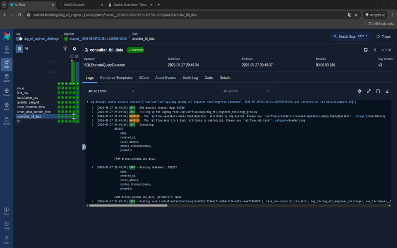
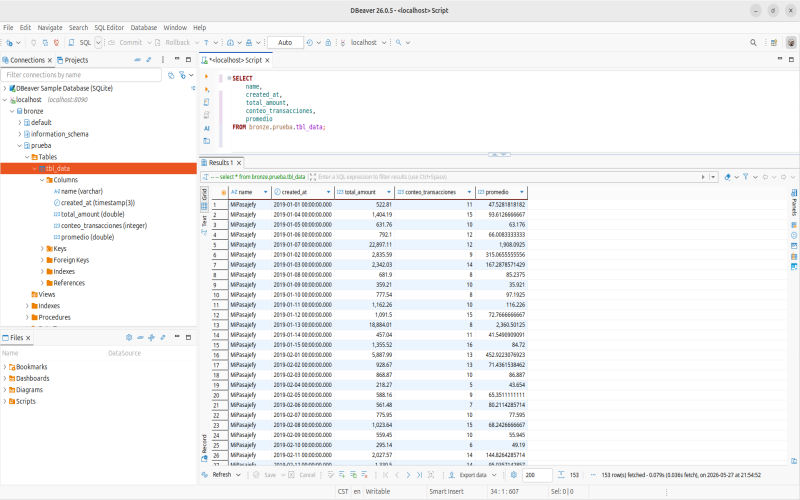

# Ejercicio 1
Generación de un pipeline en Airflow conectado a un lago de datos.

### Entorno.  

Fue necesario  instalar los paquetes `s3fs` y  `apache-airflow-providers-trino`. La instalacion se llevo acabo mediante el archivo [requirements.txt](../ejercicio1/requirements.txt) para ser instalados en los contenedores que componen la instancia de Apache Airflow atravez del [Dockerfile](../ejercicio1/Dockerfile).  

---
#### Estructura del Data Lake​  
Una vez iniciado el entorno, el primer paso fue crear los buckets **bck-landing** y **bck-bronze​** dentro de MinIO.  

#### Ingesta de datos  
Dentro del **bck-landing** cargue el archivo __*data_muestra.csv*__ con 1500 registros, este archivo fue el que utilice para desarrollar el DAG ya que la capacidad de los recursos de mi equipo no son suficientes para procesar los 10,000 registros que contienen el archivo __*data_prueba_tecnica.csv*__.  

---
### Generación de DAG  

El DAG **dag_etl_engineer_challenge** se enceuntra dentro del archivo [dag_etl_engineer_challenge.py](../ejercicio1/Airflow/dags/dag_etl_engineer_challenge.py).

#### Lectura de datos  
La lectura de datos se hace con la tarea `leer_csv` esta tarea lista los archivos que se encuentran en el bucket y hace una diagnostico de los datos que contiene el archivo. 

​
#### Limpieza, transformación y agregaciones de datos.

La tarea `transformar_csv` *limpia* los datos del campo `amount` colocando un CERO a los datos que estan vacios o nulos a los datos del campo `status` coloca el valor **desconocido**  a los datos que contienen valores que no hacen sentido por ejemplo el valor **"0xFFFF"**, que son nulos o que contienen un espacio en blanco.  

Despues de la limpieza lleva acabo una *transformacion*, coloca el tipo de dato TIMESTAMP en los campos `created_at` y  `paid_at`.

Finalmente hace la *agrupacion* sobre los campos `name` y `created_at` creando las columnas `total_amount`, `conteo_transacciones` y `promedio`.   
​

#### Almacenar Parquet  

La tarea `guardar_parquet` genera un archivo en formato parquet con el Dataset que se genero de la agrupacion antes mencionada.  

  

Este archivo es alamacenado en el bucket *bck-bronze* en el path *master* bajo el nombre *data_prueba_tecnica.parquet*.  

  

----
#### Query SQL Trino.  

La tarea `crear_esquema_trino` ejecuta la sentencia para crear el schema `bronze.prueba`.

  

La tarea `crear_tabla_parquet_trino` ejecuta la sentencia para crear la tabla `bronze.prueba.tbl_data`.

 

Por ultimo la tarea `consultar_tbl_data` ejecuta una sentencia para validar los datos de la tabla `bronze.prueba.tbl_data`.

 

----

### DBeaver

Haciendo un consulta a la tabla `bronze.prueba.tbl_data` desde DBeaver damos por finalizado el Ejercicio 1.

 
