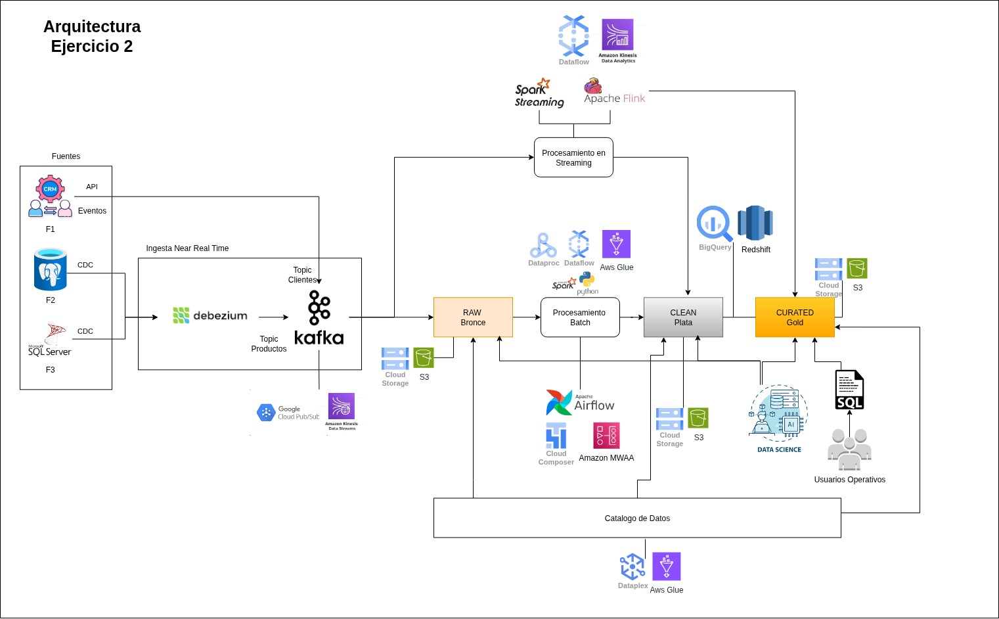

# Ejercicio 2  

Considera el siguiente escenario asumiendo el rol de ingeniero de datos:  

El área operativa del departamento de TI tiene tres aplicaciones. Para cada aplicación su fuente de datos es de tipo transaccional y las tres funcionan 24/7. Llamemosles F1, F2 y F3 respectivamente, las cuales poseen las siguientes características:  

- F1 es un CRM propietario. Contiene información sobre los clientes e.g. demográficos y datos de contacto.  
- F2 tiene un RDBMS SQL Server. Almacena las transacciones de los clientes sobre la mitad de los productos que ofrece la compañía.  
- F3 tiene un RDBMS Postgresql. Almacena las transacciones de los clientes sobre el resto de los productos.  

Ten en cuenta los siguientes supuestos:  
- Las tres fuentes de datos F1, F2 y F3 fueron diseñadas de manera independiente tanto a nivel de software como de modelo de datos.  
- Como las fuentes de datos son operativas diariamente hay datos nuevos.  
  
Tu objetivo es diseñar una arquitectura que consolide la información contenida en las fuentes de datos de F1, F2 y F3 que cumpla con dos propósitos: en primer lugar que habilite a un grupo de usuarios del área operativa a la extracción de consultas  por medio de SQL y de manera secundaria que permita al equipo de ciencia de datos la aplicación de algoritmos de detección de patrones como clustering o búsquedas en grafos. Tu diseño puede utilizar herramientas de almacenamiento y procesamiento diferentes para cada propósito si lo consideras necesario.  
 
 
Instrucciones (ejercicio 2):  
 
No olvides que las respuestas a las preguntas deben de argumentarse en el entregable.  

I.Propón una arquitectura (solo proponla no la construyas) que considere los siguientes aspectos y preguntas:  

&nbsp;&nbsp;&nbsp;&nbsp; A. De cada fuente de datos se tienen identificados que campos requiere el área operativa.  
&nbsp;&nbsp;&nbsp;&nbsp; ¿Para cumplir con los dos objetivos que subconjunto de cada fuente de datos extraerías?

    Respuesta:  
    Extraería los campos relevantes que contienen entidades, cliente, producto y transacciones, a continuación un ejemplo de cada fuente de datos:  

    • F1 (CRM) Campos de identificación del cliente (ID interno), datos demográficos (edad, género, ubicación), datos de contacto (email, teléfono), fechas de creación/actualización. Incluiría  cualquier campo de segmentación o categorización que use el negocio.  
    • F2 (SQL Server – 50% de los productos) Todas las columnas de las tablas de transacciones: ID cliente, ID producto, timestamp, importe, cantidad, canal, estado, etc. También las tablas de productos relacionadas.  
    • F3 (PostgreSQL – resto de productos) Lo mismo que F2.

&nbsp;&nbsp;&nbsp;&nbsp;  B. ¿Qué posibles retos implica la extracción de cada una de las fuentes de datos por separado y qué herramientas utilizas?  
    
    Respuesta:  
    • F1 (CRM): El reto es la falta de acceso directo a la base de datos o la ausencia de documentación, API no estándar. Herramienta: conectores personalizados en Python usando REST APIs que genere eventos.
    • F2 (SQL Server) y F3 (PostgreSQL): El reto es el bloqueo de tablas y el consumo de CPU en producción durante la lectura de millones de filas. Herramienta: Debezium (CDC) para lectura de logs de transacciones sin impactar la base de datos activa.

&nbsp;&nbsp;&nbsp;&nbsp;  C. ¿Qué posibles retos implica la independencia en el modelo de datos de las tres fuentes y cómo los resolverías?  

    Respuesta:  
    Las tres fuentes se diseñaron sin coordinación esto es de lo mas normal y comun en el ambiente empresarial, por lo que nos enfrentamos a:

    • Diferentes identificadores de cliente y producto en cuanto a nomenclatura y tipo de dato, F1, F2 y F3 pueden tener sus propios IDs, sin una clave única o solo uno puede tenerla y el otro no. 
      
    • Los modelos de datos de los productos definitivamente no son iguales en F2 y F3 manejan el 50% de productos por lo tanto cada uno tiene catálogos diferentes, con esquemas distintos. Pueden tener el mismo concepto de “venta” pero puede tener reglas de negocio diferentes.  

    Solución 

    1. Creación un proceso de resolución de entidades, con reglas determinísticas en el email, teléfono normalizado, nombres, direcciones. Podemos usar Spark ML o librerías como Splink, creando un customer_unified_id que vincula todos los IDs de las fuentes.

    2. Crear un catálogo unificado de productos, tomar los atributos comunes como por ejemplo categoría, nombre y se asigna un product_unified_id, manteniendo los IDs originales para trazabilidad.

    3. Aplicar reglas de negocio  para estandarizar campos como monto neto, fecha transaccion.  

&nbsp;&nbsp;&nbsp;&nbsp;  D. ¿Aparte de un proceso batch en la hora de menor uso, cómo podrías mitigar el impacto de tu pipeline sobre las fuentes originales ?  

    Respuesta:  
    En F2 y F3 CDC basado en logs, Debezium no compite con las transacciones en línea, solo lee los logs de la base de datos, hay un mínimo overhead. Tambien se pueden utilizar Réplicas de solo lectura para dirigir todas las consultas de extracción a réplicas secundarias (Always On, réplicas lógicas de PostgreSQL). Así la carga analítica no afecta a la instancia primaria.  

    Para F1 en la API cachear respuestas y usar estrategias de backoff exponencial, solicitar un token de alta tasa y duracion con el proveedor del CRM.

&nbsp;&nbsp;&nbsp;&nbsp;  E. ¿Cuáles etapas considerarías en tu proceso de transformación de datos y qué uso les darías?  

    Respuesta:  
    Considere la arquitectura o patrón medallion de 3 capas:  

    Ingesta (bronce – raw): datos crudos tal cual están en la fuente. Los usos comunes son auditoría, reprocesos y punto de partida para ciencia de datos.  

    Limpieza y estandarización (plata): se normalizan formatos de fecha, se eliminan duplicados, se filtran registros eliminados. Uso confiable para posteriores agrupaciones o uniones. En esta capa tambien se considera la Integración y MDM, se ejecuta el matching de clientes y la unificación de productos. Se añaden las claves globales (customer_unified_id, product_unified_id). Uso fuente única de verdad para análisis.  

    Curado (oro): Se construyen modelos dimensionales  Data Marts SQL operacional con modelo estrella o copos de nieve con tablas de hechos y dimensiones bien definidas, optimizadas para consultas puntuales. Uso en ciencia de datos, ML , DL en modelos directamente desde el Lakehouse. 

&nbsp;&nbsp;&nbsp;&nbsp;  F. ¿Qué herramientas utilizas para las etapas de transformación?  

    Respuesta:  
    • Para Alta Volumetria Apache Spark, pude usuarse en instacias onpremise y servicios en la nube como Dataproc en GCP o AWS Glue ejecutando JOBS serverless.  

    • Para menor volumetria Python, con apache beam o pandas o con servicios en la nube como Dataflow de GCP o Aws Glue.  

    • Para streaming usamos Apache Flink o Spark Streaming o con servicios en la nube como Dataflow de GCP o Amazon Kinesis Data Analytics     

&nbsp;&nbsp;&nbsp;&nbsp;  G. ¿Qué storage usarías para cada propósito y por qué ?  

    Respuesta:  
    Capas bronce, plata, oro, el almacenamiento sobre objeto en nube (S3 o Cloud Storage), unifica el stack. Servicio de consultas SQL para el área operativa, con Amazon Athena o Bigquer o Redshift spectrum, apuntan directamente a los archivos PARQUET en oro, plata o bronce. Esto evita mover datos. 

&nbsp;&nbsp;&nbsp;&nbsp;  H. Recuerda que al menos a diario tendrás que llevar data nueva a tu etapa de transformación final, ¿Como orquestarias tu pipeline y con qué herramienta?  

    Respuesta:  
    Con Apache Airflow o con servicios en la nube como Cloud Composer o AWS MWAA. 

I. Proporciona un diagrama de tu propuesta de arquitectura.  

II. Seguridad (manteniendo tu rol de ingeniero de datos).  
&nbsp;&nbsp;&nbsp;&nbsp;  A. ¿Cómo mantendrías la seguridad de tu flujo de datos end-to-end? Es decir disminuir riesgos de posibles fugas o intrusiones no deseadas al entorno de ejecución que estás construyendo.  

    Respuesta:  
    • Para los ETLs o Pipelines no colocar las credenciales de acceso a las fuente y destino en el codigo ni archivos .env ni en variables de entorno, siempre usar servicios de Secret Manager en GCP o AWS o Vault de HashiCorp.  

    • Para el alamacenamiento usar siempre cuentas de servicio asignandoles un ROL con los accesos y permisos necesarios a los servicios especificos que integran el ETL.  

    • Para los Gestores de BD como Bigquery y Redshift crear grupos de acceso con permisos granulares a nivel columna para proteger los datos sensibles y tambien ofuscar o enmascarar datos sensibles como tarjetas de credito, numeros de cuenta , montos, direcciones, telefomo, email, NSS, contraseñas, etc.

III. Gobernanza de datos  
&nbsp;&nbsp;&nbsp;&nbsp;  A. ¿Cómo llevarías control de la metadata y sus cambios al igual que los procesos de tu pipeline y cómo almacenamos estos datos?  

    Respuesta:  
    Utilizaria  AWS Glue Data Catalog  o Dataplex de GCP, estos servicios permiten tener goberbabilidad sobre el lago de datos.

## Diagrama de Arquitectura  

  

[Archivo Drawio](./docs/Ejercicio2-Diagrama-Arq.drawio)